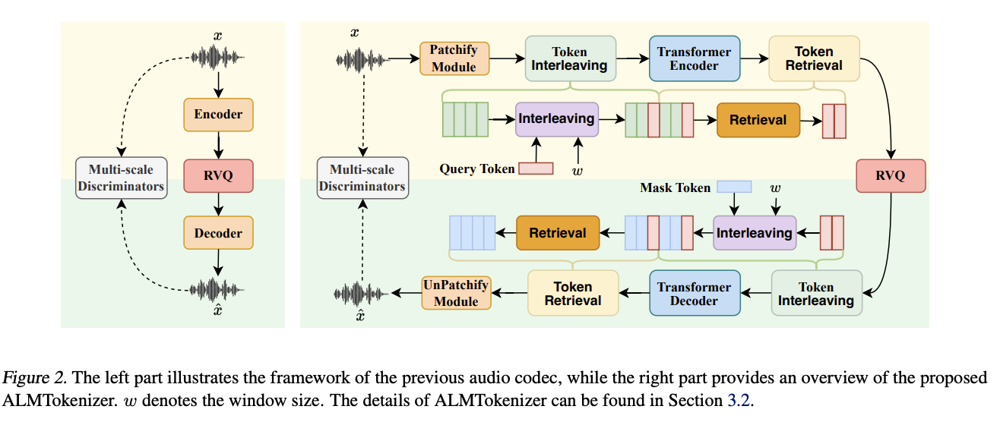

# 
 ALMTokenizer: A Low-bitrate and Semantic-rich Audio Codec Tokenizer for Audio Language Modeling 

## Introduction
Recent advancements in audio language models have underscored the pivotal role of audio tokenization, which converts audio signals into discrete tokens, thereby facilitating the application of language model architectures to the audio domain. In this study, we introduce ALMTokenizer, a novel low-bitrate and semantically rich audio codec tokenizer for audio language models. Prior methods, such as Encodec, typically encode individual audio frames into discrete tokens without considering the use of context information across frames. Unlike these methods, we introduce a novel query-based compression strategy to capture holistic information with a set of learnable query tokens by explicitly modeling the context information across frames. This design not only enables the codec model to capture more semantic information but also encodes the audio signal with fewer token sequences. Additionally, to enhance the semantic information in audio codec models, we introduce the following: (1) A masked autoencoder (MAE) loss, (2) Vector quantization based on semantic priors, and (3) An autoregressive (AR) prediction loss. As a result, ALMTokenizer achieves competitive reconstruction performance relative to state-of-the-art approaches while operating at a lower bitrate. Within the same audio language model framework, ALMTokenizer outperforms previous tokenizers in audio understanding and generation tasks.

## Overview
The overview of ALMTokenizer as following picture shows.

In the following, we will show some generated samples by our proposed method. 

## Audio Codec Tokenizer Reconstruction Comparison (Speech)

| Original Speech | 
 DAC (1.5kbps) 
 | 
 Encodec (1.5kbps) 
| 
 WavTokenizer (0.48kbps) 
 | 
 StableCodec (0.4kbps) 
 | 
 SpeechTokenizer (1.5kbps) 
 |
 Mimi (1.1kbps) 
 | 
 Mimi (0.41kbps) 
 | 
 Ours (0.41kbps) 
 |
| -----------------------     |  -----------   | ------ | ----- |
| <audio class="audio-player2" src="codec/speech/gt/p225_001.wav" controls preload></audio>   | <audio class="audio-player2" src="codec/speech/dac/p225_001.wav" controls preload></audio> | <audio class="audio-player2" src="codec/speech/encodec/p225_001.wav" controls preload></audio> |  <audio class="audio-player2" src="codec/speech/wavtokenizer/p225_001.wav" controls preload></audio> |  <audio class="audio-player2" src="codec/speech/stablecodec/p225_001.wav" controls preload></audio> |<audio class="audio-player2" src="codec/speech/speechtokenizer/p225_001.wav" controls preload></audio> |<audio class="audio-player2" src="codec/speech/mimi_8layer/p225_001.wav" controls preload></audio> |<audio class="audio-player2" src="codec/speech/mimi_3layer/p225_001.wav" controls preload></audio> |<audio class="audio-player2" src="codec/speech/ours/p225_001.wav" controls preload></audio> |
| <audio class="audio-player2" src="codec/speech/gt/p225_002.wav" controls preload></audio>   | <audio class="audio-player2" src="codec/speech/dac/p225_002.wav" controls preload></audio> | <audio class="audio-player2" src="codec/speech/encodec/p225_002.wav" controls preload></audio> |  <audio class="audio-player2" src="codec/speech/wavtokenizer/p225_002.wav" controls preload></audio> |  <audio class="audio-player2" src="codec/speech/stablecodec/p225_002.wav" controls preload></audio> |<audio class="audio-player2" src="codec/speech/speechtokenizer/p225_002.wav" controls preload></audio> |<audio class="audio-player2" src="codec/speech/mimi_8layer/p225_002.wav" controls preload></audio> |<audio class="audio-player2" src="codec/speech/mimi_3layer/p225_002.wav" controls preload></audio> |<audio class="audio-player2" src="codec/speech/ours/p225_002.wav" controls preload></audio> |
| <audio class="audio-player2" src="codec/speech/gt/p225_003.wav" controls preload></audio>   | <audio class="audio-player2" src="codec/speech/dac/p225_003.wav" controls preload></audio> | <audio class="audio-player2" src="codec/speech/encodec/p225_003.wav" controls preload></audio> |  <audio class="audio-player2" src="codec/speech/wavtokenizer/p225_003.wav" controls preload></audio> |  <audio class="audio-player2" src="codec/speech/stablecodec/p225_003.wav" controls preload></audio> |<audio class="audio-player2" src="codec/speech/speechtokenizer/p225_003.wav" controls preload></audio> |<audio class="audio-player2" src="codec/speech/mimi_8layer/p225_003.wav" controls preload></audio> |<audio class="audio-player2" src="codec/speech/mimi_3layer/p225_003.wav" controls preload></audio> |<audio class="audio-player2" src="codec/speech/ours/p225_003.wav" controls preload></audio> |
| <audio class="audio-player2" src="codec/speech/gt/p225_004.wav" controls preload></audio>   | <audio class="audio-player2" src="codec/speech/dac/p225_004.wav" controls preload></audio> | <audio class="audio-player2" src="codec/speech/encodec/p225_004.wav" controls preload></audio> |  <audio class="audio-player2" src="codec/speech/wavtokenizer/p225_004.wav" controls preload></audio> |  <audio class="audio-player2" src="codec/speech/stablecodec/p225_004.wav" controls preload></audio> |<audio class="audio-player2" src="codec/speech/speechtokenizer/p225_004.wav" controls preload></audio> |<audio class="audio-player2" src="codec/speech/mimi_8layer/p225_004.wav" controls preload></audio> |<audio class="audio-player2" src="codec/speech/mimi_3layer/p225_004.wav" controls preload></audio> |<audio class="audio-player2" src="codec/speech/ours/p225_004.wav" controls preload></audio> |
| <audio class="audio-player2" src="codec/speech/gt/p226_002.wav" controls preload></audio>   | <audio class="audio-player2" src="codec/speech/dac/p226_002.wav" controls preload></audio> | <audio class="audio-player2" src="codec/speech/encodec/p226_002.wav" controls preload></audio> |  <audio class="audio-player2" src="codec/speech/wavtokenizer/p226_002.wav" controls preload></audio> |  <audio class="audio-player2" src="codec/speech/stablecodec/p226_002.wav" controls preload></audio> |<audio class="audio-player2" src="codec/speech/speechtokenizer/p226_002.wav" controls preload></audio> |<audio class="audio-player2" src="codec/speech/mimi_8layer/p226_002.wav" controls preload></audio> |<audio class="audio-player2" src="codec/speech/mimi_3layer/p226_002.wav" controls preload></audio> |<audio class="audio-player2" src="codec/speech/ours/p226_002.wav" controls preload></audio> |
| <audio class="audio-player2" src="codec/speech/gt/p231_001.wav" controls preload></audio>   | <audio class="audio-player2" src="codec/speech/dac/p231_001.wav" controls preload></audio> | <audio class="audio-player2" src="codec/speech/encodec/p231_001.wav" controls preload></audio> |  <audio class="audio-player2" src="codec/speech/wavtokenizer/p231_001.wav" controls preload></audio> |  <audio class="audio-player2" src="codec/speech/stablecodec/p231_001.wav" controls preload></audio> |<audio class="audio-player2" src="codec/speech/speechtokenizer/p231_001.wav" controls preload></audio> |<audio class="audio-player2" src="codec/speech/mimi_8layer/p231_001.wav" controls preload></audio> |<audio class="audio-player2" src="codec/speech/mimi_3layer/p231_001.wav" controls preload></audio> |<audio class="audio-player2" src="codec/speech/ours/p231_001.wav" controls preload></audio> |
| <audio class="audio-player2" src="codec/speech/gt/p231_002.wav" controls preload></audio>   | <audio class="audio-player2" src="codec/speech/dac/p231_002.wav" controls preload></audio> | <audio class="audio-player2" src="codec/speech/encodec/p231_002.wav" controls preload></audio> |  <audio class="audio-player2" src="codec/speech/wavtokenizer/p231_002.wav" controls preload></audio> |  <audio class="audio-player2" src="codec/speech/stablecodec/p231_002.wav" controls preload></audio> |<audio class="audio-player2" src="codec/speech/speechtokenizer/p231_002.wav" controls preload></audio> |<audio class="audio-player2" src="codec/speech/mimi_8layer/p231_002.wav" controls preload></audio> |<audio class="audio-player2" src="codec/speech/mimi_3layer/p231_002.wav" controls preload></audio> |<audio class="audio-player2" src="codec/speech/ours/p231_002.wav" controls preload></audio> |
| <audio class="audio-player2" src="codec/speech/gt/p232_001.wav" controls preload></audio>   | <audio class="audio-player2" src="codec/speech/dac/p232_001.wav" controls preload></audio> | <audio class="audio-player2" src="codec/speech/encodec/p232_001.wav" controls preload></audio> |  <audio class="audio-player2" src="codec/speech/wavtokenizer/p232_001.wav" controls preload></audio> |  <audio class="audio-player2" src="codec/speech/stablecodec/p232_001.wav" controls preload></audio> |<audio class="audio-player2" src="codec/speech/speechtokenizer/p232_001.wav" controls preload></audio> |<audio class="audio-player2" src="codec/speech/mimi_8layer/p232_001.wav" controls preload></audio> |<audio class="audio-player2" src="codec/speech/mimi_3layer/p232_001.wav" controls preload></audio> |<audio class="audio-player2" src="codec/speech/ours/p232_001.wav" controls preload></audio> |
| <audio class="audio-player2" src="codec/speech/gt/p266_005.wav" controls preload></audio>   | <audio class="audio-player2" src="codec/speech/dac/p266_005.wav" controls preload></audio> | <audio class="audio-player2" src="codec/speech/encodec/p266_005.wav" controls preload></audio> |  <audio class="audio-player2" src="codec/speech/wavtokenizer/p266_005.wav" controls preload></audio> |  <audio class="audio-player2" src="codec/speech/stablecodec/p266_005.wav" controls preload></audio> |<audio class="audio-player2" src="codec/speech/speechtokenizer/p266_005.wav" controls preload></audio> |<audio class="audio-player2" src="codec/speech/mimi_8layer/p266_005.wav" controls preload></audio> |<audio class="audio-player2" src="codec/speech/mimi_3layer/p266_005.wav" controls preload></audio> |<audio class="audio-player2" src="codec/speech/ours/p266_005.wav" controls preload></audio> |

## Audio Codec Tokenizer Reconstruction Comparison (Sound)

| Original Audio | 
 DAC (1.5kbps) 
 | 
 Encodec (1.5kbps) 
| 
 WavTokenizer (0.48kbps) 
 | 
 Ours (0.41kbps) 
 |
| -----------------------     |  -----------   | ------ | ----- |
| <audio class="audio-player2" src="codec/sound/gt/1-137-A-32.wav" controls preload></audio>   | <audio class="audio-player2" src="codec/sound/dac/1-137-A-32.wav" controls preload></audio> | <audio class="audio-player2" src="codec/sound/encodec/1-137-A-32.wav" controls preload></audio> | <audio class="audio-player2" src="codec/sound/wavtokenizer/1-137-A-32.wav" controls preload></audio> | <audio class="audio-player2" src="codec/sound/ours/1-137-A-32.wav" controls preload></audio> |
| <audio class="audio-player2" src="codec/sound/gt/1-1791-A-26.wav" controls preload></audio>   | <audio class="audio-player2" src="codec/sound/dac/1-1791-A-26.wav" controls preload></audio> | <audio class="audio-player2" src="codec/sound/encodec/1-1791-A-26.wav" controls preload></audio> | <audio class="audio-player2" src="codec/sound/wavtokenizer/1-1791-A-26.wav" controls preload></audio> | <audio class="audio-player2" src="codec/sound/ours/1-1791-A-26.wav" controls preload></audio> |
| <audio class="audio-player2" src="codec/sound/gt/1-4211-A-12.wav" controls preload></audio>   | <audio class="audio-player2" src="codec/sound/dac/1-4211-A-12.wav" controls preload></audio> | <audio class="audio-player2" src="codec/sound/encodec/1-4211-A-12.wav" controls preload></audio> | <audio class="audio-player2" src="codec/sound/wavtokenizer/1-4211-A-12.wav" controls preload></audio> | <audio class="audio-player2" src="codec/sound/ours/1-4211-A-12.wav" controls preload></audio> |
| <audio class="audio-player2" src="codec/sound/gt/1-5996-A-6.wav" controls preload></audio>   | <audio class="audio-player2" src="codec/sound/dac/1-5996-A-6.wav" controls preload></audio> | <audio class="audio-player2" src="codec/sound/encodec/1-5996-A-6.wav" controls preload></audio> | <audio class="audio-player2" src="codec/sound/wavtokenizer/1-5996-A-6.wav" controls preload></audio> | <audio class="audio-player2" src="codec/sound/ours/1-5996-A-6.wav" controls preload></audio> |
| <audio class="audio-player2" src="codec/sound/gt/1-7057-A-12.wav" controls preload></audio>   | <audio class="audio-player2" src="codec/sound/dac/1-7057-A-12.wav" controls preload></audio> | <audio class="audio-player2" src="codec/sound/encodec/1-7057-A-12.wav" controls preload></audio> | <audio class="audio-player2" src="codec/sound/wavtokenizer/1-7057-A-12.wav" controls preload></audio> | <audio class="audio-player2" src="codec/sound/ours/1-7057-A-12.wav" controls preload></audio> |
| <audio class="audio-player2" src="codec/sound/gt/1-7456-A-13.wav" controls preload></audio>   | <audio class="audio-player2" src="codec/sound/dac/1-7456-A-13.wav" controls preload></audio> | <audio class="audio-player2" src="codec/sound/encodec/1-7456-A-13.wav" controls preload></audio> | <audio class="audio-player2" src="codec/sound/wavtokenizer/1-7456-A-13.wav" controls preload></audio> | <audio class="audio-player2" src="codec/sound/ours/1-7456-A-13.wav" controls preload></audio> |
| <audio class="audio-player2" src="codec/sound/gt/1-7973-A-7.wav" controls preload></audio>   | <audio class="audio-player2" src="codec/sound/dac/1-7973-A-7.wav" controls preload></audio> | <audio class="audio-player2" src="codec/sound/encodec/1-7973-A-7.wav" controls preload></audio> | <audio class="audio-player2" src="codec/sound/wavtokenizer/1-7973-A-7.wav" controls preload></audio> | <audio class="audio-player2" src="codec/sound/ours/1-7973-A-7.wav" controls preload></audio> |
| <audio class="audio-player2" src="codec/sound/gt/1-7974-A-49.wav" controls preload></audio>   | <audio class="audio-player2" src="codec/sound/dac/1-7974-A-49.wav" controls preload></audio> | <audio class="audio-player2" src="codec/sound/encodec/1-7974-A-49.wav" controls preload></audio> | <audio class="audio-player2" src="codec/sound/wavtokenizer/1-7974-A-49.wav" controls preload></audio> | <audio class="audio-player2" src="codec/sound/ours/1-7974-A-49.wav" controls preload></audio> |
| <audio class="audio-player2" src="codec/sound/gt/1-7974-B-49.wav" controls preload></audio>   | <audio class="audio-player2" src="codec/sound/dac/1-7974-B-49.wav" controls preload></audio> | <audio class="audio-player2" src="codec/sound/encodec/1-7974-B-49.wav" controls preload></audio> | <audio class="audio-player2" src="codec/sound/wavtokenizer/1-7974-B-49.wav" controls preload></audio> | <audio class="audio-player2" src="codec/sound/ours/1-7974-B-49.wav" controls preload></audio> |

## Audio Codec Tokenizer Reconstruction Comparison (Music)

| Original Audio | 
 DAC (1.5kbps) 
 | 
 Encodec (1.5kbps) 
| 
 WavTokenizer (0.48kbps) 
 | 
 Ours (0.41kbps) 
 |
| -----------------------     |  -----------   | ------ | ----- |
| <audio class="audio-player2" src="codec/music/gt/-0Gj8-vB1q4.wav" controls preload></audio>   | <audio class="audio-player2" src="codec/music/dac/-0Gj8-vB1q4.wav" controls preload></audio> | <audio class="audio-player2" src="codec/music/encodec/-0Gj8-vB1q4.wav" controls preload></audio> | <audio class="audio-player2" src="codec/music/wavtokenizer/-0Gj8-vB1q4.wav" controls preload></audio> | <audio class="audio-player2" src="codec/music/ours/-0Gj8-vB1q4.wav" controls preload></audio> |
| <audio class="audio-player2" src="codec/music/gt/-0SdAVK79lg.wav" controls preload></audio>   | <audio class="audio-player2" src="codec/music/dac/-0SdAVK79lg.wav" controls preload></audio> | <audio class="audio-player2" src="codec/music/encodec/-0SdAVK79lg.wav" controls preload></audio> | <audio class="audio-player2" src="codec/music/wavtokenizer/-0SdAVK79lg.wav" controls preload></audio> | <audio class="audio-player2" src="codec/music/ours/-0SdAVK79lg.wav" controls preload></audio> |
| <audio class="audio-player2" src="codec/music/gt/-0vPFx-wRRI.wav" controls preload></audio>   | <audio class="audio-player2" src="codec/music/dac/-0vPFx-wRRI.wav" controls preload></audio> | <audio class="audio-player2" src="codec/music/encodec/-0vPFx-wRRI.wav" controls preload></audio> | <audio class="audio-player2" src="codec/music/wavtokenizer/-0vPFx-wRRI.wav" controls preload></audio> | <audio class="audio-player2" src="codec/music/ours/-0vPFx-wRRI.wav" controls preload></audio> |
| <audio class="audio-player2" src="codec/music/gt/-1UWSisR2zo.wav" controls preload></audio>   | <audio class="audio-player2" src="codec/music/dac/-1UWSisR2zo.wav" controls preload></audio> | <audio class="audio-player2" src="codec/music/encodec/-1UWSisR2zo.wav" controls preload></audio> | <audio class="audio-player2" src="codec/music/wavtokenizer/-1UWSisR2zo.wav" controls preload></audio> | <audio class="audio-player2" src="codec/music/ours/-1UWSisR2zo.wav" controls preload></audio> |
| <audio class="audio-player2" src="codec/music/gt/-3Kv4fdm7Uk.wav" controls preload></audio>   | <audio class="audio-player2" src="codec/music/dac/-3Kv4fdm7Uk.wav" controls preload></audio> | <audio class="audio-player2" src="codec/music/encodec/-3Kv4fdm7Uk.wav" controls preload></audio> | <audio class="audio-player2" src="codec/music/wavtokenizer/-3Kv4fdm7Uk.wav" controls preload></audio> | <audio class="audio-player2" src="codec/music/ours/-3Kv4fdm7Uk.wav" controls preload></audio> |
| <audio class="audio-player2" src="codec/music/gt/-88me9bBzrk.wav" controls preload></audio>   | <audio class="audio-player2" src="codec/music/dac/-88me9bBzrk.wav" controls preload></audio> | <audio class="audio-player2" src="codec/music/encodec/-88me9bBzrk.wav" controls preload></audio> | <audio class="audio-player2" src="codec/music/wavtokenizer/-88me9bBzrk.wav" controls preload></audio> | <audio class="audio-player2" src="codec/music/ours/-88me9bBzrk.wav" controls preload></audio> |
| <audio class="audio-player2" src="codec/music/gt/-Dtir74TiUM.wav" controls preload></audio>   | <audio class="audio-player2" src="codec/music/dac/-Dtir74TiUM.wav" controls preload></audio> | <audio class="audio-player2" src="codec/music/encodec/-Dtir74TiUM.wav" controls preload></audio> | <audio class="audio-player2" src="codec/music/wavtokenizer/-Dtir74TiUM.wav" controls preload></audio> | <audio class="audio-player2" src="codec/music/ours/-Dtir74TiUM.wav" controls preload></audio> |
| <audio class="audio-player2" src="codec/music/gt/-FFx68qSAuY.wav" controls preload></audio>   | <audio class="audio-player2" src="codec/music/dac/-FFx68qSAuY.wav" controls preload></audio> | <audio class="audio-player2" src="codec/music/encodec/-FFx68qSAuY.wav" controls preload></audio> | <audio class="audio-player2" src="codec/music/wavtokenizer/-FFx68qSAuY.wav" controls preload></audio> | <audio class="audio-player2" src="codec/music/ours/-FFx68qSAuY.wav" controls preload></audio> |

## Text-to-Speech Generation.

In the following, we first show some case generated by audio language model with ALMTokenizer

| 
  Content (The transcirption of the target audio) 
 | 
 Generated 
 |
| -----------------------     |  -----------   | ------ | ----- |-------|
| cosette was no longer in rags she was in mourning.  | <audio class="audio-player2" src="speech_demo/ours/setence_level_text_audio_interleaved_174-168635-0014_sample.wav" controls preload></audio> |
| then tom who had been stunned by some falling debris raised himself to a sitting position  | <audio class="audio-player2" src="speech_demo/ours/setence_level_text_audio_interleaved_251-137823-0008_sample.wav" controls preload></audio> |
| this dressing should stand in the ice box four or five hours to become seasoned  | <audio class="audio-player2" src="speech_demo/ours/setence_level_text_audio_interleaved_652-129742-0018_sample.wav" controls preload></audio> |
| he can't stand the notion of any cruelty  | <audio class="audio-player2" src="speech_demo/ours/setence_level_text_audio_interleaved_777-126732-0080_sample.wav" controls preload></audio> |
| on the general principles of art mister quilter writes with equal lucidity  | <audio class="audio-player2" src="speech_demo/ours/setence_level_text_audio_interleaved_1272-128104-0006_sample.wav" controls preload></audio> |
| the other voice snapped with a harsh urgency clearly used to command  | <audio class="audio-player2" src="speech_demo/ours/setence_level_text_audio_interleaved_1272-141231-0011_sample.wav" controls preload></audio> |
| when they entered the stage box on the left the first act was well under way the scene being the interior of a cabin in the south of ireland  | <audio class="audio-player2" src="speech_demo/ours/setence_level_text_audio_interleaved_1462-170138-0006_sample.wav" controls preload></audio> |
| sir harry towne bowed and said that he had met mister alexander and his wife in tokyo  | <audio class="audio-player2" src="speech_demo/ours/setence_level_text_audio_interleaved_1462-170138-0017_sample.wav" controls preload></audio> |
| hilda sat on the arm of it and put her hands lightly on his shoulders  | <audio class="audio-player2" src="speech_demo/ours/setence_level_text_audio_interleaved_1462-170142-0038_sample.wav" controls preload></audio> |
| the son of a virgin generated by the ineffable operation of the holy spirit was a creature without example or resemblance superior in every attribute of mind and body to the children of adam  | <audio class="audio-player2" src="speech_demo/ours/setence_level_text_audio_interleaved_1673-143396-0005_sample.wav" controls preload></audio> |
| i hear the t v going for a few minutes then pop turns it off and goes in the kitchen to talk to mom  | <audio class="audio-player2" src="speech_demo/ours/setence_level_text_audio_interleaved_1988-24833-0017_sample.wav" controls preload></audio> |
| yes my lord we should try in vain  | <audio class="audio-player2" src="speech_demo/ours/setence_level_text_audio_interleaved_2803-154320-0009_sample.wav" controls preload></audio> |
| who came next on the scene some people from the lobby  | <audio class="audio-player2" src="speech_demo/ours/setence_level_text_audio_interleaved_3081-166546-0056_sample.wav" controls preload></audio> |
| it has not been running since last night or it would be full of curious people all the time hustling to get a glimpse of this place  | <audio class="audio-player2" src="speech_demo/ours/setence_level_text_audio_interleaved_3081-166546-0067_sample.wav" controls preload></audio> |
| cautiously placing a hand against the rocks to steady himself tad wisely concluded that hereafter it would not pay to be too curious  | <audio class="audio-player2" src="speech_demo/ours/setence_level_text_audio_interleaved_6313-66125-0015_sample.wav" controls preload></audio> |
| tad is an experienced rider  | <audio class="audio-player2" src="speech_demo/ours/setence_level_text_audio_interleaved_6313-66129-0028_sample.wav" controls preload></audio> |
| what did he mean asked pyrrha  | <audio class="audio-player2" src="speech_demo/ours/setence_level_text_audio_interleaved_6319-57405-0010_sample.wav" controls preload></audio> |
| then she turned towards the quarter indicated and disappeared round the laurel bushes  | <audio class="audio-player2" src="speech_demo/ours/setence_level_text_audio_interleaved_6345-93306-0006_sample.wav" controls preload></audio> |
| and some of the birds who were attentive and careful soon saw how it was done and started nice homes for themselves  | <audio class="audio-player2" src="speech_demo/ours/setence_level_text_audio_interleaved_7850-281318-0014_sample.wav" controls preload></audio> |
| no battery in the whole four years war lost so many men in so short a time  | <audio class="audio-player2" src="speech_demo/ours/setence_level_text_audio_interleaved_7976-105575-0005_sample.wav" controls preload></audio> |
| randal waited a while in london on the chance that bennydeck might pay him a visit  | <audio class="audio-player2" src="speech_demo/ours/setence_level_text_audio_interleaved_8297-275154-0003_sample.wav" controls preload></audio> |
| the only true motive for putting poetry into a fresh language must be to endow a fresh nation as far as possible with one more possession of beauty  | <audio class="audio-player2" src="speech_demo/ours/setence_level_text_audio_interleaved_8842-302196-0003_sample.wav" controls preload></audio> |

## More Text-to-Audio Generation Results

In the following, we first show some case generated by audio language model with ALMTokenizer

| 
 Discription 
 | 
 Generated 
 |
| -----------------------     |  -----------   | ------ | ----- |-------|
| Someone is typing on a computer keyboard  | <audio class="audio-player2" src="audio_demo/sound/setence_level_text_audio_interleaved_Ywob-3S4VjMs_sample.wav" controls preload></audio> |
| A frog vocalizes as birds chirp  | <audio class="audio-player2" src="audio_demo/sound/setence_level_text_audio_interleaved_YwqUmIEzuNz4_sample.wav" controls preload></audio> |
| This catchy tune is a dynamic blend of pop and rock, featuring soaring guitar riffs, driving drums, and an infectious chorus that will have you dancing along in no time.  | <audio class="audio-player2" src="audio_demo/music/setence_level_text_audio_interleaved_615631.clip_sample.wav" controls preload></audio> |
| This alternative indie rock anthem is a fierce and empowering manifesto, blending the confrontational intensity of heavy metal and hard rock with a visceral, funk-infused sound, cathartic R&B-inspired vocal hooks and explosive alternative pop rock arrangements, all driven by a street smart attitude and a cool and cocky swagger that make it a truly revolutionary and volatile statement of artistic rebellion.  | <audio class="audio-player2" src="audio_demo/music/setence_level_text_audio_interleaved_651118.clip_sample.wav" controls preload></audio> |
| This upbeat pop rock anthem will get you moving and singing along in no time!  | <audio class="audio-player2" src="audio_demo/music/setence_level_text_audio_interleaved_1023763.clip_sample.wav" controls preload></audio> |
| The song Grit and Grime captures the quintessential sound of the dirty south with its heavy bass, gritty vocals, and raw lyrics.  | <audio class="audio-player2" src="audio_demo/music/setence_level_text_audio_interleaved_1086107.clip_sample.wav" controls preload></audio> |
| This contemporary pop rock album is an intense, confrontational and visceral musical journey that takes listeners on a freewheeling exploration of self-awareness, searching for freedom and reflection. With acerbic lyrics that are both cynical and sarcastic, the singer songwriter deals with themes of love and romance while also exploring more sentimental and poignant subjects through bittersweet ballads and fiery rocknroll anthems. The album combines amiable good-natured moments of relaxation and hanging out with heartfelt and earnest reflections on life, all delivered with an honest and passionate energy. From playful and humorous tracks to intimate and literate ballads, this cathartic and self-conscious album is a perfect mix of contemporary pop-rock, album rock, and singer-songwriter styles that showcase the artist's range and depth.  | <audio class="audio-player2" src="audio_demo/music/setence_level_text_audio_interleaved_1207860.clip_sample.wav" controls preload></audio> |
